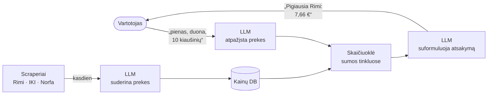
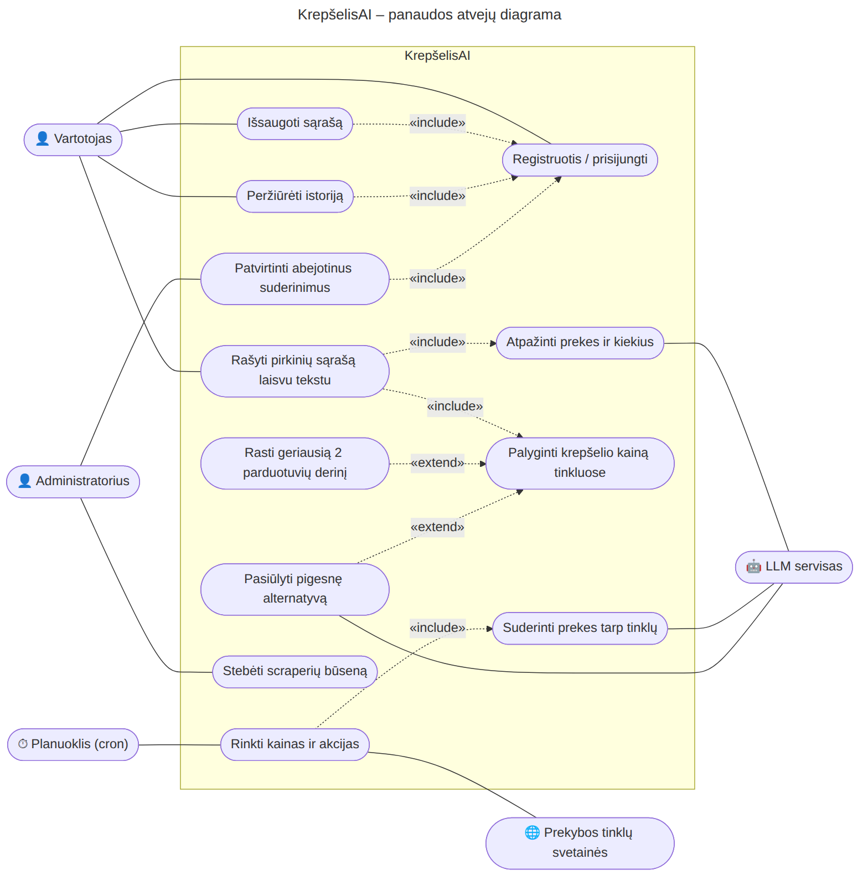
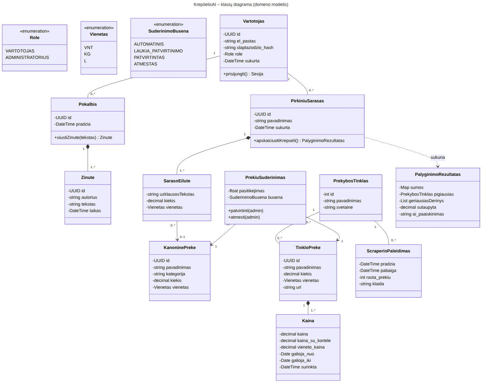
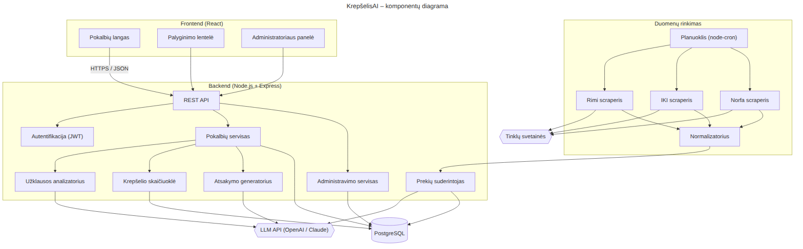
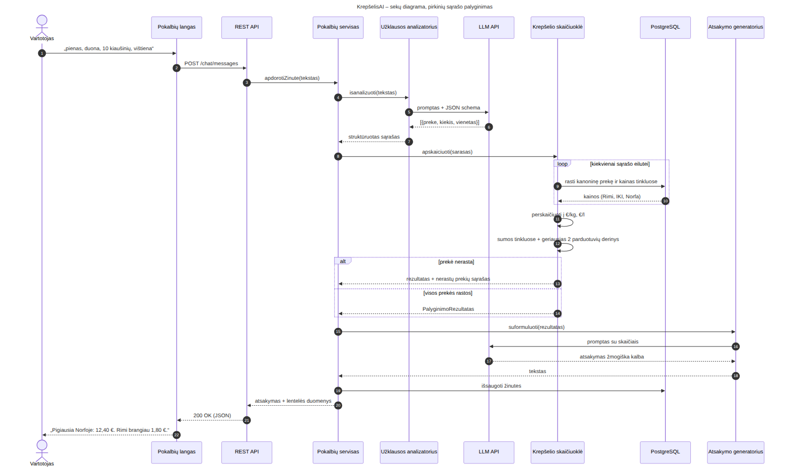
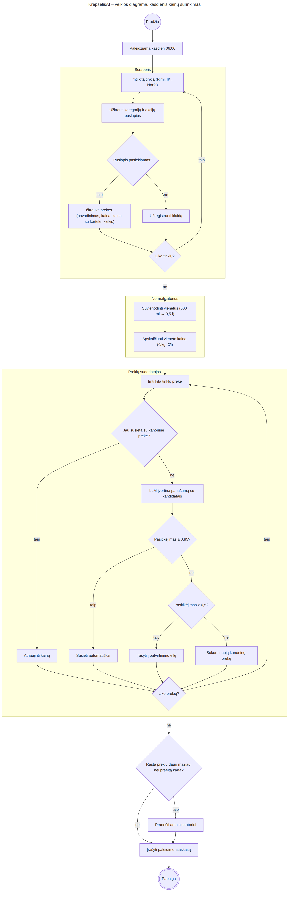
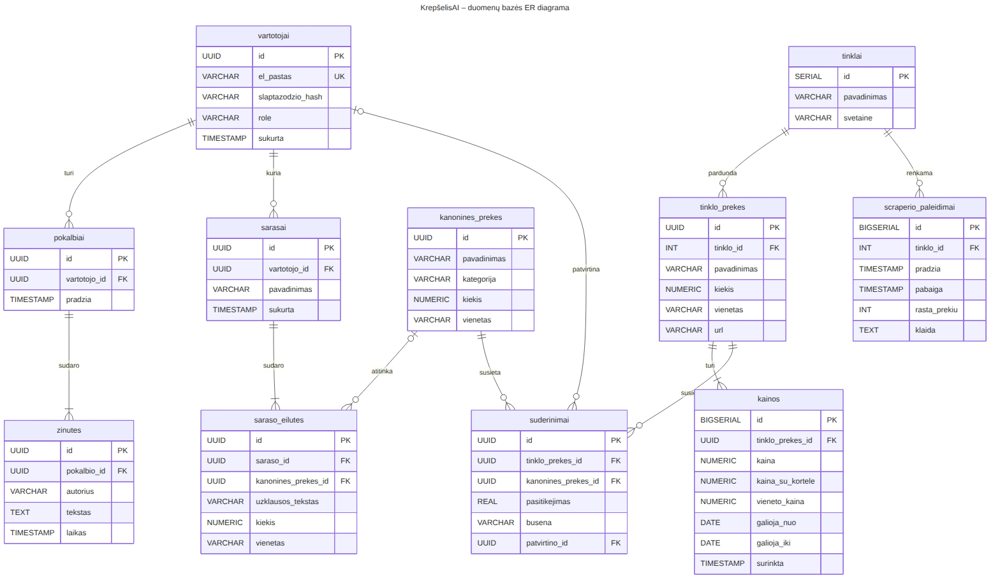
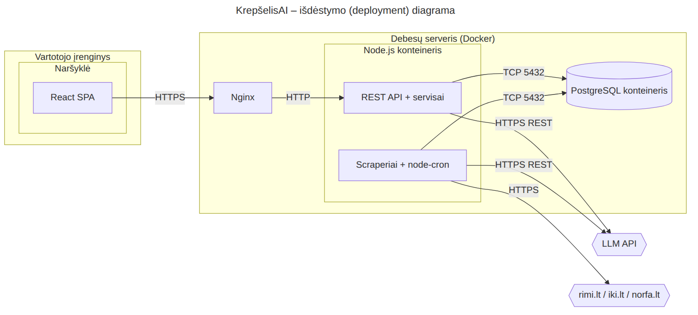

<div align="center">

# KrepšelisAI

**Parašyk, ką nori nusipirkti, ir sužinok, kur pigiausia.**

AI pokalbių asistentas, kuris palygina viso pirkinių krepšelio kainą Rimi, IKI ir Norfa tinkluose.


**Komanda:** Edvin Vilkanec · Gabriel Baranovskij

</div>

---

## Kaip tai atrodo

> **Vartotojas:** Reikia pieno, duonos, 10 kiaušinių ir sviesto
>
> **KrepšelisAI:** Pigiausia apsipirkti **Rimi**: su kortele **7,66 €**. Brangiausia IKI, 8,02 €, tad sutaupysite 0,36 €. Pirkti dviejose parduotuvėse neapsimoka.

## Kaip tai veikia



Generatyvinis DI atlieka tris darbus:

| | Ką daro | Pavyzdys |
|---|---|---|
| 1 | **Supranta užklausą** | „pusė kilogramo sūrio“ → `suris_kg`, 0,5 kg |
| 2 | **Suderina prekes tarp tinklų** | „DVARO pienas 3,5 % 1 l“ ir „Natural DVARO milk 3,5%“ = ta pati prekė |
| 3 | **Paaiškina rezultatą** | skaičiai → aiškus atsakymas su pasiūlymais |

Pačios sumos skaičiuojamos įprastu kodu, ne DI, todėl rezultatas visada tikslus.

## End-To-End pavyzdžiai

| # | X (vartotojo užklausa) | y (atsakymas) | Ką tikrina |
|---|---|---|---|
| 01 | Reikia pieno, duonos, 10 kiaušinių ir sviesto | **Rimi**, 7,66 € | Paprastas sąrašas |
| 02 | Vakarienei reikės 1 kg vištienos filė, pakelio spagečių, 2 l pieno ir pusės kilogramo sūrio | **Rimi**, 13,25 € | Kiekiai ir vienetai |
| 03 | Savaitei: 2 kg bananų, pusantro kilogramo obuolių, malta kava, 2 duonos ir 20 kiaušinių | **Norfa**, 18,32 € → **IKI + Norfa** 17,21 € | Kada apsimoka 2 parduotuvės |
| 04 | pienas, sviestas ir 3 avokadai | **Rimi**, 3,48 €, avokadų nerasta | Prekė, kurios nėra kataloge |

Pilni atsakymai: [`data/`](data/) · Testavimo promptai GPT agentui: [`prompts/`](prompts/)

### Kaip išbandyti

1. Atsidarykite [`prompts/test_prompt_01.md`](prompts/test_prompt_01.md) ir nukopijuokite tekstą po linija `---`.
2. Įklijuokite į ChatGPT.
3. Palyginkite atsakymą su [`data/pavyzdys_01.json`](data/pavyzdys_01.json).

Norint perskaičiuoti visus (X, y) iš kainų katalogo:

```bash
python scripts/generuoti_poras.py
```

## Repozitorijos struktūra

```
krepselisai/
├── data/              (X, y) poros ir pavyzdinis kainų katalogas
├── prompts/           sisteminis promptas ir 4 testavimo promptai
├── scripts/           (X, y) porų generatorius
└── docs/diagrams/
    ├── plantuml/      7 diagramos .puml
    ├── mermaid/       tos pačios 7 diagramos .mmd
    └── png/           sugeneruoti paveikslėliai
```

## Technologijos

| Dalis | Technologija |
|---|---|
| Sąsaja | React |
| Serveris | Node.js + Express (TypeScript) |
| Kainų rinkimas | fetch + cheerio, node-cron |
| Duomenų bazė | PostgreSQL |
| DI | LLM API (OpenAI arba Claude) |
| Diegimas | Docker + Nginx |

---

## Diagramos

Kiekviena diagrama sukurta dviem formatais: **PlantUML** ir **Mermaid**. Spauskite ant pavadinimo, kad išskleistumėte.

<details>
<summary><b>1. Panaudos atvejų diagrama</b></summary>
<br/>



[PlantUML](docs/diagrams/plantuml/01_panaudos_atvejai.puml) · [Mermaid](docs/diagrams/mermaid/01_panaudos_atvejai.mmd) · [PlantUML paveikslėlis](docs/diagrams/png/01_panaudos_atvejai.png)
</details>

<details>
<summary><b>2. Klasių diagrama (domeno modelis)</b></summary>
<br/>



[PlantUML](docs/diagrams/plantuml/02_klasiu_diagrama.puml) · [Mermaid](docs/diagrams/mermaid/02_klasiu_diagrama.mmd) · [PlantUML paveikslėlis](docs/diagrams/png/02_klasiu_diagrama.png)
</details>

<details>
<summary><b>3. Komponentų diagrama</b></summary>
<br/>



[PlantUML](docs/diagrams/plantuml/03_komponentu_diagrama.puml) · [Mermaid](docs/diagrams/mermaid/03_komponentu_diagrama.mmd) · [PlantUML paveikslėlis](docs/diagrams/png/03_komponentu_diagrama.png)
</details>

<details>
<summary><b>4. Sekų diagrama: pirkinių sąrašo palyginimas</b></summary>
<br/>



[PlantUML](docs/diagrams/plantuml/04_seku_pokalbis.puml) · [Mermaid](docs/diagrams/mermaid/04_seku_pokalbis.mmd) · [PlantUML paveikslėlis](docs/diagrams/png/04_seku_pokalbis.png)
</details>

<details>
<summary><b>5. Veiklos diagrama: kasdienis kainų surinkimas</b></summary>
<br/>



[PlantUML](docs/diagrams/plantuml/05_veiklos_scrapinimas.puml) · [Mermaid](docs/diagrams/mermaid/05_veiklos_scrapinimas.mmd) · [PlantUML paveikslėlis](docs/diagrams/png/05_veiklos_scrapinimas.png)
</details>

<details>
<summary><b>6. Duomenų bazės ER diagrama</b></summary>
<br/>



[PlantUML](docs/diagrams/plantuml/06_er_duomenu_baze.puml) · [Mermaid](docs/diagrams/mermaid/06_er_duomenu_baze.mmd) · [PlantUML paveikslėlis](docs/diagrams/png/06_er_duomenu_baze.png)
</details>

<details>
<summary><b>7. Išdėstymo (deployment) diagrama</b></summary>
<br/>



[PlantUML](docs/diagrams/plantuml/07_isdestymo_diagrama.puml) · [Mermaid](docs/diagrams/mermaid/07_isdestymo_diagrama.mmd) · [PlantUML paveikslėlis](docs/diagrams/png/07_isdestymo_diagrama.png)
</details>

> Mermaid neturi atskiro panaudos atvejų ir išdėstymo diagramų tipo, todėl jos nubraižytos kaip `flowchart`, išlaikant aktorius ir `«include»` / `«extend»` ryšius.

---

<div align="center">
<sub>Kainos <code>data/kainos.csv</code> faile yra pavyzdinės ir skirtos testavimui. Projektas sukurtas mokymosi tikslais, VILNIUSTECH.</sub>
</div>
